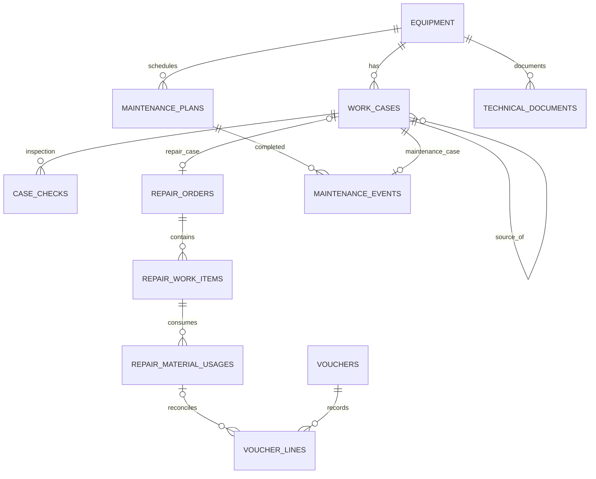

# TV-EAM: mã vụ việc và phiếu đầu ca

Phiếu đầu ca là một vụ việc `KT`, không phải một loại hồ sơ sửa chữa. Vụ việc là lớp nhận diện chung cho sửa chữa, bảo dưỡng, vệ sinh và kiểm tra. Hồ sơ sửa chữa HS vẫn độc lập, có nhiều hạng mục và sáu tiến độ riêng.

| Loại | Prefix | Ví dụ |
|---|---|---|
| Sửa chữa | SC | SC-QC10-20261009-083015-0001 |
| Bảo dưỡng | BD | BD-RTG22-20261009-090000-0001 |
| Vệ sinh | VS | VS-QC10-20261009-093000-0001 |
| Kiểm tra / đầu ca | KT | KT-QC10-20261009-070000-0001 |

## Quy tắc

- Thời gian là lúc công việc thực sự bắt đầu, không phải lúc người dùng nhập dữ liệu. Lưu `actual_started_at` và `actual_ended_at` bằng timestamptz; hiển thị và cấp mã theo Asia/Bangkok (UTC+7).
- Cơ sở dữ liệu cấp mã, không dùng đếm dòng trong React. Bộ đếm khóa theo thiết bị + loại việc + ngày thực tế, cập nhật nguyên tử.
- UUID là khóa liên kết. Mã đọc được có UNIQUE trong phạm vi thiết bị; mã phương tiện duy nhất trong không gian dữ liệu cá nhân.
- Số thứ tự tăng trong ngày, theo loại việc. Hai việc cùng giây vẫn có hậu tố khác nhau.
- Sửa thời gian bản nháp không đổi mã đã cấp. Mã là nhãn nhận diện lịch sử, thời gian thực tế là trường nghiệp vụ có audit. Phiếu đã gửi không sửa trực tiếp.
- Gửi lại cùng request_key và nội dung trả về đúng UUID cũ. Request_key đã dùng cho nội dung khác bị từ chối.
- Người dùng giữ request_key trong lần gửi và các lần thử lại, không tạo UUID mới mỗi lần bấm.
- Chuyển KT bất thường sang SC tạo vụ việc con tham chiếu KT và hồ sơ HS. Chuyển lại trả về cùng hồ sơ, không nhân đôi.
- Không xóa chứng từ nghiệp vụ: hủy/đóng/archived và audit. Số thứ tự không cần liên tục, không được tái sử dụng.

## Quan hệ

Mẫu giao diện: Loại việc → chọn phương tiện → thời gian bắt đầu/kết thúc thực tế → nội dung/checklist → gửi. Mã hiển thị sau khi lưu thành công, không cho nhập tay. Một người có thể mang cả bốn vai trò; không bắt buộc nhiều người ký duyệt.
